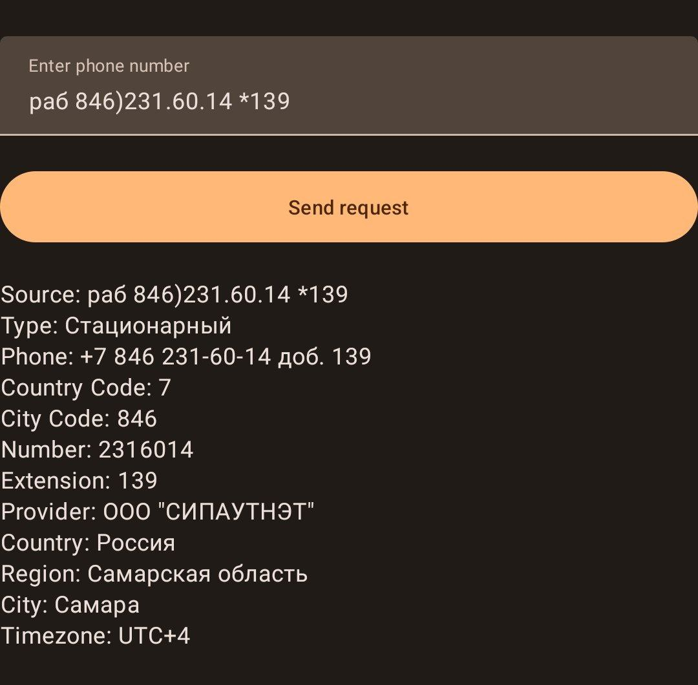

# Lab 6 Variant 4



## API keys
1. Sign up and get api keys on https://dadata.ru/api/clean/phone/
2. In root directory of project create if does not exist file `gradle.properties` and add:
    ```
    API_KEY=yourapikeywithoutquotatinmarks
    SECRET_KEY=yoursecretkeywithoutquotatinmarks
    ```